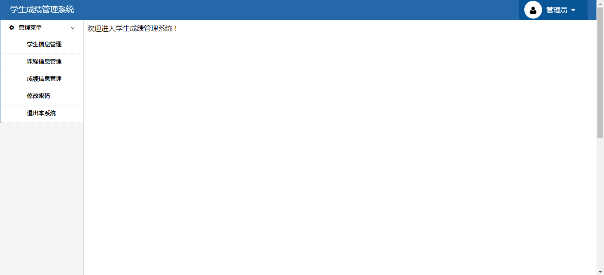
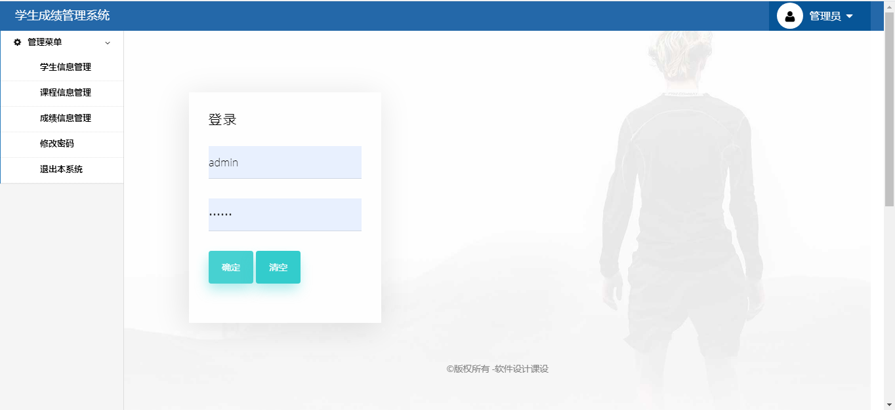
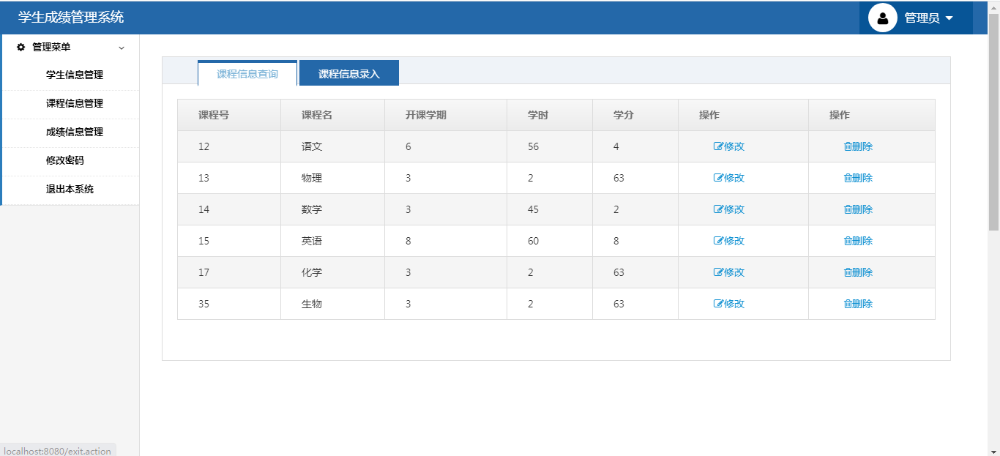
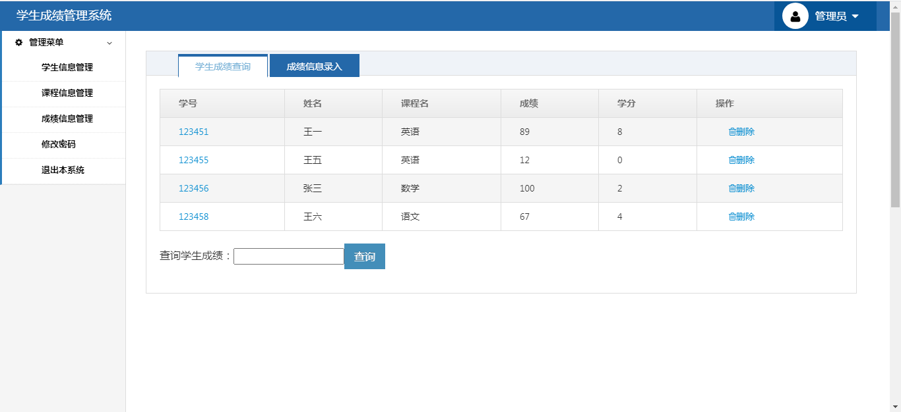

<h1 align="center">学生成绩管理系统</h1>

## 简介
学生成绩管理系统：角色分为管理员与普通用户；功能包括学生信息管理、课程信息管理、成绩信息管理、密码修改与系统退出等，便于高效管理学生和课程相关数据。    --计算机毕业设计源码；毕设源码；java毕业设计源码

## 联系方式

<h3 align="center">获取完整代码与数据库文件 + 微信：deepguan QQ: 86050149 QQ群: 783742310</h3>

<h3 align="center">可帮忙远程部署 包运行成功！提供远程部署、修改代码、设计文档指导、代码讲解等服务！</h3>

## 功能介绍（完整见运行截图）
管理员：学生成绩管理系统包括管理学生信息、管理课程信息和管理成绩信息功能。管理员可以通过简单直观的用户界面轻松管理以上信息，提供完善的查询、增删改等操作。此外，系统提供了修改密码和退出系统的安全功能，确保用户账户的安全性。管理员可以通过登录界面输入用户名和密码来访问系统，并查看和调整个人信息。

学生：学生可以通过系统进行成绩查询，查看自己的课程成绩和学分信息。通过输入学号进行快速查询，方便快捷。此外，学生还可以进行个人信息的管理，确保信息的准确性和完整性。系统设计简洁，操作简单，便于学生使用。

## 运行截图

本代码来源于网络,仅供学习参考使用!

